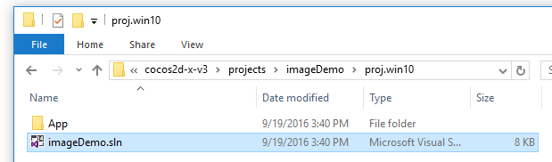
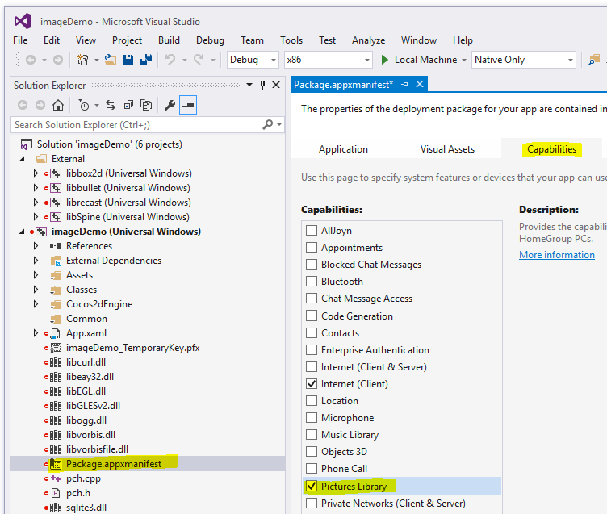
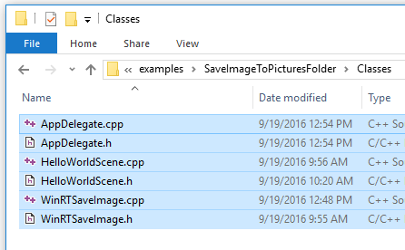
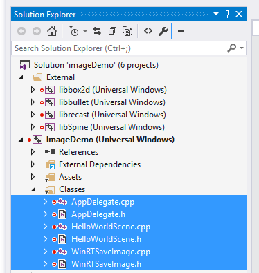
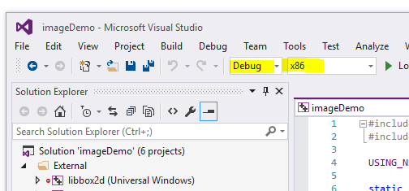
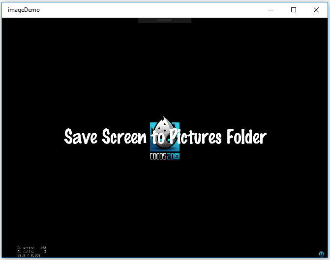
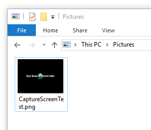

# How to Save a Cocos2d-x Screen Capture Image to a User's Pictures Folder (Windows 10 and Windows 8.1) #

This example demonstrates how to save a Cocos2d-x screen capture image to the user's Pictures Folder on Windows 10 and Windows 8.1. The cocos2d function 
cocos2d::utils::captureScreen() will save a screen capture to the writeable folder of the Windows 10 application. However, this folder is not easily
accessible to the user. On Windows 10, each user has a Pictures folder located at C:\Users\<username>\Pictures. This example shows how to modify a Cocos2d-x
Windows 10 app to save the screen capture to the Pictures folder. These instructions will also works for Windows 8.1 Store and Phone projects.

---

##Setup##

1. Download or clone this repo

1. Create a new Cocos2d-x project

	$ cocos new imageDemo -l cpp -d projects

1. Open the Windows 10 UWP imageDemo solution in your project's proj.win10 folder.

1. Double click on the Package.AppManifest file and navigate to the **Add | Reference** menu item.

1. Copy the files in this repo's Classes folder into your project's Classes folder

1. Add the new Classes files to the Classes folder in your imageDemo project

1. Select the Debug | x86 project configuration. Build and run the solution

    
1. When the app runs, click on the Save Screen to Pictures Folder menu item

1. The app saves the file to the user's Pictures folder.

1. For an example on how to save to the user's Pictures folder on Windows 10 , take a look at the following files:
 
* [HelloWorldScene.cpp](https://github.com/stammen/cocos2d-x-win10-examples/blob/master/examples/SaveImageToPicturesFolder/Classes/HelloWorldScene.cpp)
* [HelloWorldScene.h](https://github.com/stammen/cocos2d-x-win10-examples/blob/master/examples/SaveImageToPicturesFolder/Classes/HelloWorldScene.h) 

Look for the code inside of **#if CC_TARGET_PLATFORM == CC_PLATFORM_WINRT**
This code will also work for Windows 8.1 Universal Apps.
